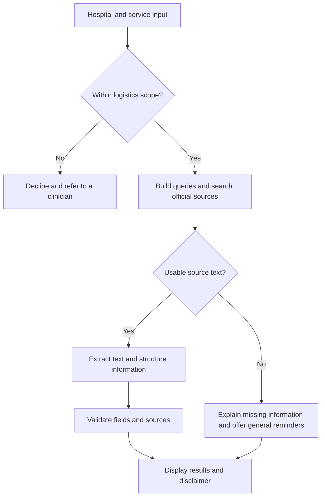

# MedReady Agent

A lightweight AI agent that turns official hospital information into practical pre-visit checklists. Users enter a hospital name and an examination or department to find preparation requirements, documents to bring, appointment instructions, and visit logistics.

**Status: MVP planning stage.** This README describes the proposed architecture and development plan. Features, directories, API contracts, and deployment steps below are implementation targets, not confirmation of working or validated software.

> This tool provides hospital visit logistics only and does not constitute medical advice. Confirm specific requirements with the hospital.

## Scope

MedReady Agent retrieves, extracts, and organizes publicly available hospital visit information. When information is missing, it should clearly state the uncertainty rather than infer hospital requirements. It does not provide symptom assessment, diagnosis, medication advice, or treatment recommendations.

Questions about stopping or adjusting medication, or any other decision requiring individual clinical judgment, should be referred to the hospital or a clinician. Content restrictions, source attribution, and disclaimers are design requirements; they do not establish regulatory certification.

## Planned MVP Features

| Feature | Information provided |
| --- | --- |
| Fasting and dietary preparation | Requirements explicitly stated by the hospital, with a confirmation prompt when details are unavailable |
| Documents and materials | Items to bring, accompanying notes, and a checklist users can mark off |
| Appointments and check-in | Booking channels, check-in procedures, and timing requirements |
| Department location | Campus, building, floor, and examination room information |
| Estimated costs | Fees or ranges explicitly listed in the source |
| Insurance information | Published guidance on insurance use and designated provider requirements |
| Additional reminders | Other preparation instructions supported by the source material |

Every result must display its sources and the standard disclaimer. Fees, insurance policies, and visit requirements may change; the hospital's latest instructions take precedence.

## Intended User Experience

1. Enter a hospital name, such as “Peking Union Medical College Hospital.”
2. Enter an examination or department, such as “gastroscopy under sedation” or “cardiology outpatient clinic.”
3. Select **Generate preparation checklist** and wait while the application retrieves and organizes public information.
4. Review the checklist, mark items as packed, check the sources, and confirm any unclear requirements with the hospital.

This is the target interaction flow. The MVP interface is planned in Streamlit. Examples are translated for documentation and do not imply that English-language search has been validated.

## Architecture

The MVP uses a layered Python architecture, with native Python orchestrating the agent workflow. LangChain and complex middleware are not required by the initial design.

| Layer | Responsibility | Planned technology |
| --- | --- | --- |
| User interface | Accept hospital and service inputs; display preparation checklists | Streamlit; a WeChat Mini Program may follow |
| API | Request validation, CORS, rate limiting, and consistent error handling | FastAPI, Pydantic, Uvicorn |
| Agent core | Workflow orchestration, result validation, and disclaimer injection | Native Python |
| Tools | Search, HTML extraction, and structured information extraction | Search provider, Requests, BeautifulSoup4, Doubao model API |
| Cache | Reduce repeated queries and API costs | Optional local file cache; Redis in a later iteration |
| Content controls | Input filtering, source attribution, and output constraints | Keyword filters, prompt constraints, JSON validation |

The original proposal selected Bing Web Search API and Doubao. Provider availability, model identifiers, SDKs, and request parameters must be confirmed during implementation; a validated integration configuration has not yet been established.

### Agent Workflow



The search module is planned to generate three query groups covering examination instructions, appointment procedures, and documents for outpatient visits. It should prioritize hospital websites and relevant official domains. Each search returns up to five results; the main workflow selects the top three for text extraction.

After cleaning, text from each page is planned to be limited to 3,000 characters. Structured extraction must use only retrieved reference content. The model must not fill gaps caused by truncation or extraction failures with invented information.

## Planned Project Structure

```text
medready-agent/
├── config/
│   └── .env             # Local secrets and configuration; excluded from Git
├── core/
│   ├── search.py        # Search and query generation
│   ├── extractor.py     # Web page text extraction
│   ├── llm.py           # Model calls and structured extraction
│   └── agent.py         # Workflow orchestration
├── api/
│   └── main.py          # FastAPI entry point
├── frontend/
│   └── app.py           # Streamlit interface
├── utils/
│   ├── validator.py     # JSON and field validation
│   └── compliance.py    # Input and content boundary checks
├── requirements.txt     # Dependency list
└── README.md
```

Planned dependencies: Python 3.10+, `fastapi`, `uvicorn`, `python-dotenv`, `requests`, `beautifulsoup4`, `pydantic`, and `streamlit`. Model or search SDKs will be added according to the selected integrations, with versions pinned after validation.

## Local Setup Target

These commands apply once the proposed source files, dependency list, and configuration loader have been implemented. The README alone cannot launch the application.

1. Create a virtual environment from the repository root:

   ```bash
   python -m venv .venv
   ```

   Activate it on macOS or Linux:

   ```bash
   source .venv/bin/activate
   ```

   Or in Windows PowerShell:

   ```powershell
   .venv\Scripts\Activate.ps1
   ```

2. Install the project dependencies:

   ```bash
   python -m pip install -r requirements.txt
   ```

3. Populate `config/.env` with the model and search credentials, endpoints, and model identifier required by the final configuration implementation. Environment variable names are still to be defined. Add this file to `.gitignore`; never commit real credentials.

4. Start the backend:

   ```bash
   python -m uvicorn api.main:app --reload --port 8000
   ```

5. In another terminal with the virtual environment activated, start the frontend:

   ```bash
   python -m streamlit run frontend/app.py
   ```

The frontend must be configured to call the local FastAPI service. Use `--reload` only for local development.

## API Design

### Generate a Preparation Checklist

`POST /api/v1/prepare`

Example request:

```json
{
  "hospital": "Example Hospital",
  "service": "Gastroscopy under sedation"
}
```

The following illustrates the target response structure, not actual requirements for a hospital. The server injects `disclaimer` into every result.

```json
{
  "code": 200,
  "msg": "success",
  "data": {
    "fasting_requirement": "Please confirm requirements with the hospital.",
    "materials_list": [],
    "appointment_process": "No clear information available. Please confirm with the hospital.",
    "department_location": "No clear information available. Please confirm with the hospital.",
    "estimated_cost": "No clear information available. Please confirm with the hospital.",
    "insurance_tips": "No clear information available. Please confirm with the hospital.",
    "attention_points": [],
    "source_note": "No usable source found.",
    "disclaimer": "This tool provides hospital visit logistics only and does not constitute medical advice. Confirm specific requirements with the hospital."
  }
}
```

| Field | Type | Description |
| --- | --- | --- |
| `fasting_requirement` | string | Fasting and dietary preparation supported by source text |
| `materials_list` | array of objects | Each item contains `name` and `note` strings |
| `appointment_process` | string | Booking and check-in instructions |
| `department_location` | string | Department or examination room location |
| `estimated_cost` | string | Cost information explicitly stated in the source |
| `insurance_tips` | string | Insurance usage information |
| `attention_points` | array of strings | Additional preparation reminders |
| `source_note` | string | Source page titles; the display layer should also retain corresponding links for verification |
| `disclaimer` | string | Standard disclaimer |

Missing string fields should contain an explicit uncertainty message. Array fields should remain empty when no supported items can be extracted. Invalid inputs, search failures, inaccessible pages, and invalid model output should receive clear error handling. The target rate limit is 10 requests per IP address per minute; error codes and the rate limiting implementation remain to be defined.

## Information Quality and Privacy Requirements

- Extract only information explicitly present in the reference text; do not invent missing details.
- Prioritize official hospital sources and retain page titles and links for verification.
- Decline diagnosis, symptom assessment, medication, and treatment requests, directing users to a clinician. Keyword filtering is only one layer of this control.
- Explain the product's scope at the top of the interface and show sources and the disclaimer below results.
- Clearly identify missing search results. General preparation reminders must not be presented as requirements from a specific hospital.
- Do not collect or retain identity document numbers, medical records, or other sensitive information. Focus logs on timing, status, and troubleshooting; minimize retained query text and avoid recording sensitive content in complete inputs or outputs.
- Supply secrets through local configuration or deployment environment variables, never through source code, container images, or public logs.

## Development Roadmap

The original plan targets an eight-day MVP. This is a proposed schedule; actual delivery depends on integration work and testing outcomes.

| Phase | Target | Deliverables |
| --- | --- | --- |
| Phase 0: Preparation | Day 1 | Product boundaries, input filtering rules, disclaimer, API accounts, and local environment |
| Phase 1: Backend | Days 2–4 | Project skeleton, search, text extraction, model extraction, agent orchestration, and API |
| Phase 2: Frontend | Days 5–6 | Streamlit interface, result cards, loading and error states, and integration |
| Phase 3: Testing | Day 7 | 20 test cases, failure analysis, and prompt refinement |
| Phase 4: Deployment | Day 8 | Dockerfile, Compose configuration, service deployment, and basic monitoring |

### MVP Acceptance Targets

- [ ] Hospital and service inputs complete the search, extraction, validation, and display workflow.
- [ ] Tests cover common examinations and departments, incorrect hospital names, ambiguous services, and empty results.
- [ ] Results are checked for accuracy, field completeness, and source support.
- [ ] Missing fields, invalid JSON, inaccessible pages, and API errors receive explicit handling.
- [ ] Medical advice requests are declined, and every result includes the disclaimer.
- [ ] The interface displays a materials checklist, sources, and uncertainty messages.
- [ ] API rate limiting and secret injection meet the design requirements.

## Deployment Plan

The project plans to use Docker and Docker Compose to run the FastAPI backend and Streamlit frontend, with credentials supplied through environment variables. Validated container configuration and a live demo URL are not yet provided. Deployment commands will be added once the required files are implemented.

## Future Enhancements

- **Query caching:** Evaluate local file caching or Redis. The original proposal suggests seven days; the actual expiry should reflect how frequently hospital information changes.
- **Map navigation:** Integrate Amap to provide hospital locations and navigation links.
- **Visit reminders:** Send advance reminders after a user selects a visit date and authorizes notifications.
- **Examination form recognition:** Extract examination names from uploaded images, with explicit handling and deletion of sensitive information.

## Contributing

Use GitHub Issues to suggest features, report problems, or submit de-identified test cases. Pull requests can improve implementation and documentation. New features should remain within the project's hospital visit logistics scope; changes to extraction behavior should include source evidence or relevant test cases.

Do not submit real medical records, identity document numbers, API credentials, or other sensitive information in issues, logs, or examples.

## License

A license has not yet been specified. Once added, the repository's `LICENSE` file will define the applicable terms.
